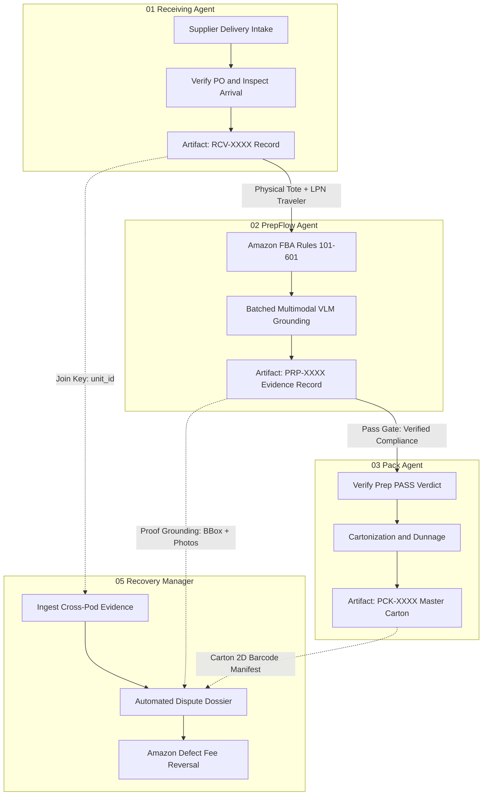
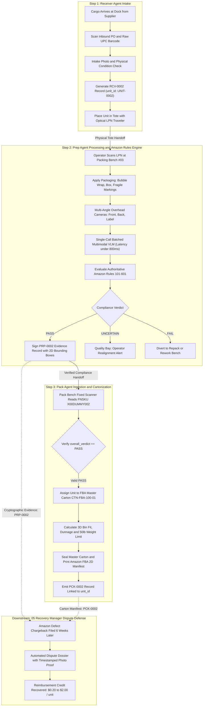

# Inter-Agent Data & Evidence Contract: Receiver → Prep → Pack

**Physical Commerce Context Stream · Step 2: PrepFlow (Prep Manager)**  
**Repository:** `cube-02-prep-manager` (Fork)  
**Participant:** Manideep (`manideep667320`)  
**Standard:** CUBE Buildathon Round 2 · Pod Interoperability Gate  

---

## 1. Purpose

This contract establishes the formal, deterministic data and physical hand-off protocol among the first three stages of the physical e-commerce inbound-to-outbound chain:



#### 📋 Visual Pipeline Summary

| Stage | Agent | Inbound Inputs | Execution & Tasks | Emitted Artifact | Downstream Impact |
|:---:|:---|:---|:---|:---|:---|
| **01** | **Receiving Agent** | Supplier PO, ASN, raw UPC/EAN | Intake photo, damage check, carton check | `RCV-XXXX` *(Intake Record)* | Registers initial unit condition |
| ⬇️ | *Physical Tote Handoff* | *Optical LPN Traveler (`unit_id`)* | *Conveyor transfer to Prep Bench* | | |
| **02** | **PrepFlow Agent** *(Current)* | `RCV` record, FNSKU, Work Order | Amazon Rules 101-601, Batched VLM | `PRP-XXXX` *(Evidence Record)* | **Defends $0.40–$1.10 Margin** |
| ⬇️ | *Quality Gate* | *Hard Invariant: `overall_verdict == PASS`* | *Re-wrap or Rework if FAIL/UNCERTAIN* | | |
| **03** | **Pack Agent** | `PRP` record (`overall_verdict: PASS`) | 3D Bin cartonization, dunnage, FBA Box ID | `PCK-XXXX` *(Master Carton)* | Enforces 50lb weight limit |
| ⬇️ | *Carrier Dock* | *Amazon FBA Inbound Delivery* | *6-Week Fulfillment Window* | | |
| **05** | **Recovery Manager** | `PRP` photos + `PCK` packing slip | Automated Seller Central dispute claim | **Claim Victory Dossier** | **Recovers $0.20–$2.00 / unit** |

### Objectives
1. **Eliminate Downstream Chargebacks:** Ensure that no non-compliant unit ever transitions from Prep to Pack without verifiable visual proof adhering to Amazon Seller Central FBA requirements ([Rules 101–601](file:///c:/Users/manid/Desktop/cube26-prp-0200-manideep667320/submissions/manideep667320/agent/amazon_rules.py)).
2. **Deterministic Interoperability:** Guarantee that all agent payloads share common identifiers (`unit_id`, `org_id`, `work_order_id`, `fba_shipment_id`) and conform to strict JSON schemas.
3. **Protect Unit Economics:** Provide the Pack Agent with the exact prepped dimensions, tare weights, and handling flags needed for optimal cartonization without re-scanning or manual re-inspection, preserving the prep center's **$0.40 to $1.10 gross margin**.
4. **Arm Recovery Manager (Step 5):** Create an unbroken cryptographic chain of evidence from initial container unloading through master carton sealing.

---

## 2. Receiver Agent Inputs (Inputs to Prep Agent)

When physical cargo arrives at the warehouse dock from suppliers or freight carriers, the **Receiving Agent (Agent 01)** performs initial intake inspection, matches against the Inbound Purchase Order (PO), registers product metadata, and routes individual units to the prep bench.

### 2.1 Required Data Fields

| Field Name | Type | Format / Constraints | Description |
|---|---|---|---|
| `record_id` | String | `^RCV-[0-9]{4,}$` | Unique receiving event ID (e.g. `RCV-0002`). |
| `unit_id` | String | `^UNIT-[0-9]{4,}$` | Global canonical unit identifier (e.g. `UNIT-0002`). |
| `org_id` | String | `enum: ["org_demo_alpha", "org_demo_bravo"]` | Tenant identifier enforcing PostgreSQL Row-Level Security (RLS). |
| `work_order_id` | String | `^WO-[0-9]{4,}$` | Prep work order detailing required operations (e.g. `WO-3000`). |
| `inbound_po_id` | String | `^PO-[0-9]{4,}$` | Supplier Purchase Order number (e.g. `PO-84920`). |
| `supplier_id` | String | Non-empty alphanumeric string | Source vendor / manufacturer code (e.g. `SUP-CANDLE-CORP`). |
| `sku` | String | Merchant SKU | Inventory tracking identifier (e.g. `SKU-CANDLE-3`). |
| `asin` | String | `^B[0-9A-Z]{9}$` | Amazon Standard Identification Number (e.g. `B0DUMMY964`). |
| `fnsku` | String | `^[X0][0-9A-Z]{9}$` | Amazon Fulfillment Network barcode string (e.g. `X00DUMMY002`). |
| `fba_shipment_id` | String | `^FBA-[0-9A-Z]{6,}$` | Target Amazon Inbound Shipment ID (e.g. `FBA-DUMMY-100`). |
| `prep_price_usd` | Float | `0.40` to `1.10` | Agreed prep fee per unit in USD. |
| `initial_condition`| String | `enum: ["intact", "crushed_box", "leaking", "torn_packaging", "dirty"]` | Physical condition observed upon dock arrival. |
| `raw_barcode` | String | 12-14 digits (UPC/EAN) | Original manufacturer barcode on product packaging. |
| `category` | String | `enum: ["fragile", "liquid", "apparel", "consumable", "general", "set"]` | Product taxonomy determining mandatory Amazon FBA prep rules. |
| `is_perishable` | Boolean | `true` or `false` | Indicates if product has an expiration date. |
| `raw_dimensions_cm`| Array[Float] | `[length, width, height]` | Unprepped physical dimensions in centimeters. |
| `raw_weight_g` | Float | Positive number | Unprepped weight in grams. |
| `work_order_tasks`| Object | Key-value boolean flags | Explicit tasks ordered by seller (`wo_polybag`, `wo_warning`, etc.). |
| `rcv_photo_refs` | Array[String] | Tenant-scoped paths | Intake photos: `["storage/{org_id}/RCV_UNIT-0002_front.jpg"]`. |
| `received_at` | String | ISO-8601 UTC | Intake timestamp (`2026-10-01T08:15:30Z`). |
| `receiver_id` | String | Non-empty alphanumeric | Badge ID of dock receiver operator. |

### 2.2 Validation Rules & Preconditions
1. **Intact Condition Gate:** If `initial_condition` is `"leaking"` or `"crushed_box"`, the unit MUST be flagged with `disposition: "quarantine_damaged"` and routed to exception staging. Prep Agent will not execute standard FBA prep on hazardous or unsellable stock.
2. **Tenant Scoping:** Image paths in `rcv_photo_refs` must reside strictly in the tenant's partitioned directory (`/storage/{org_id}/...`). Any attempt to pass cross-tenant paths is rejected immediately (Rule 1).
3. **FNSKU & ASIN Coherence:** `fnsku` must correspond directly to the catalog record for `asin`.
4. **Physical Traveler:** The physical unit is delivered to the prep packing station inside a tote with an optical License Plate Number (LPN) or barcode label matching `unit_id`.

---

## 3. Prep Agent Outputs (Exported by PrepFlow)

After receiving the unit, PrepFlow’s operator performs bagging, bubble wrapping, labeling, or taping as required. When the unit is scanned on the packing bench, PrepFlow captures multi-angle camera feeds, runs the batched multimodal VLM ([Rule 2](file:///c:/Users/manid/Desktop/cube26-prp-0200-manideep667320/submissions/manideep667320/agent/vlm_client.py)), validates against Amazon Seller Central FBA requirements ([Rule 5](file:///c:/Users/manid/Desktop/cube26-prp-0200-manideep667320/submissions/manideep667320/agent/amazon_rules.py)), and exports an immutable compliance evidence record.

### 3.1 Data Specification: `PrepManagerEvidenceRecord`
Conforms strictly to [`prep_evidence_contract.json`](file:///c:/Users/manid/Desktop/cube26-prp-0200-manideep667320/submissions/manideep667320/contract/prep_evidence_contract.json):

```json
{
  "$schema": "https://cube-buildathon.org/schemas/prep_evidence_v2.json",
  "record_id": "PRP-0002",
  "unit_id": "UNIT-0002",
  "org_id": "org_demo_alpha",
  "work_order_id": "WO-3000",
  "fba_shipment_id": "FBA-DUMMY-100",
  "sku": "SKU-CANDLE-3",
  "asin": "B0DUMMY964",
  "fnsku": "X00DUMMY002",
  "prep_price_usd": 0.40,
  "overall_verdict": "PASS",
  "checks": {
    "polybag_present_sealed": "not_required",
    "suffocation_warning": "not_required",
    "fnsku_label_placement": "flat",
    "original_barcode_covered": "yes",
    "expiry_date": "not_required",
    "handling_marks": "all_present"
  },
  "evidence_grounding": [
    {
      "check_id": "fnsku_label_placement",
      "photo_ref": "storage/org_demo_alpha/UNIT-0002_label.jpg",
      "bbox": [620, 310, 840, 760],
      "confidence": 0.98,
      "observation_text": "FNSKU barcode is placed flat on package surface with required quiet zone."
    }
  ],
  "photo_refs": [
    "storage/org_demo_alpha/UNIT-0002_front.jpg",
    "storage/org_demo_alpha/UNIT-0002_label.jpg"
  ],
  "operator_override": null,
  "operator_id": "op_amira",
  "captured_at": "2026-10-01T12:00:00Z",
  "package_attributes": {
    "prepped_dimensions_cm": [12.5, 12.5, 15.0],
    "prepped_weight_g": 385.0,
    "prep_type_applied": "bubble_wrap_box",
    "handling_labels_affixed": ["fragile", "this_way_up"]
  }
}
```

### 3.2 Output Packaging & Transport
1. **JSON Ledger Entry:** Saved to PostgreSQL database table `prep_records` (enforcing PostgreSQL RLS) and published to the warehouse event bus topic `inbound.prep.completed`.
2. **Physical Package Artifacts:**
   - **Applied Packaging:** Polybag (≥1.5 mil), bubble-wrap, or corrugated container.
   - **Scannable FNSKU Barcode:** Verified flat, with pristine quiet zones, placed over and fully obscuring the manufacturer UPC.
   - **Special Handling Markings:** Bright red "FRAGILE" stickers, "LIQUID" warnings, or black orientation arrows affixed in visible quadrants.
3. **Conveyor Routing Signal:**
   - `PASS`: Unit releases to outbound Packing station conveyor.
   - `FAIL`: Diverter gate routes tote to manual rework bench.
   - `UNCERTAIN` / `pending_review`: Routes to quality audit lane for operator realignment or offline buffer resolution.

---

## 4. Pack Agent Required Inputs (Consumed by Pack Manager)

The **Pack Agent (Agent 03)** is responsible for case packing (cartonization), dunnage insertion, master carton sealing, Amazon FBA Box ID label application, and palletization. The Pack Agent consumes PrepFlow’s output to validate readiness, balance box weight limits, and assemble carton-level packing slips.

### 4.1 Input Mapping Table (Pack &larr; Prep)

| Pack Agent Required Input | Source Prep Output Field | Purpose in Pack Agent | Default / Fallback Handling |
|---|---|---|---|
| `unit_id` | `PrepRecord.unit_id` | Scanned by bench overhead camera to match physical tote item. | Required. No fallback allowed. |
| `fba_shipment_id` | `PrepRecord.fba_shipment_id` | Validates unit belongs to the master carton's designated FBA shipment. | Rejects carton assignment if shipment IDs mismatch. |
| `overall_verdict` | `PrepRecord.overall_verdict` | **HARD GATE:** Strictly permits packing only if `PASS` or valid `operator_override`. | If `FAIL`/`UNCERTAIN`, diverts to rework bench. |
| `fnsku` | `PrepRecord.fnsku` | Enters unit into master carton manifest (Amazon 2D barcode specification). | Scanned from physical label; must match JSON record. |
| `sku`, `asin` | `PrepRecord.sku`, `asin` | Line item declaration in Amazon Carton Contents. | Read directly from Prep record. |
| `handling_marks` | `PrepRecord.checks.handling_marks` | Determines carton-level hazard/warning stickers and dunnage cushions. | Defaults to standard corrugated box dunnage if `not_required`. |
| `prepped_dimensions_cm`| `PrepRecord.package_attributes.prepped_dimensions_cm` | 3D Bin Packing Algorithm to choose carton size (e.g. 18x14x12 in). | Defaults to `raw_dimensions_cm` + 1.5 cm buffer. |
| `prepped_weight_g` | `PrepRecord.package_attributes.prepped_weight_g` | Sums master carton gross weight to prevent exceeding Amazon 50.0 lb (22.6 kg) limit. | Defaults to `raw_weight_g` + 30 g packaging allowance. |
| `expiry_date` | `PrepRecord.checks.expiry_date` | Enforces Amazon rule: all units in carton must expire within 90 days of each other. Carton label prints earliest expiry date. | If `not_required`, carton marked non-perishable. |
| `prep_record_id` | `PrepRecord.record_id` | Logged in master carton audit trail for Step 5 Recovery dispute claim generation. | Required for cross-pod traceability. |

---

## 5. Contract Rules & Non-Negotiable Standards

### 5.1 Formatting & Schema Requirements
- **JSON Schema:** Strict schema validation against draft 2020-12 ([prep_evidence_contract.json](file:///c:/Users/manid/Desktop/cube26-prp-0200-manideep667320/submissions/manideep667320/contract/prep_evidence_contract.json)).
- **Timestamps:** UTC ISO-8601 with trailing `Z` timezone (`YYYY-MM-DDTHH:MM:SSZ`).
- **Normalized Coordinates:** Grounding bounding boxes MUST be normalized integers from `0` to `1000` in `[ymin, xmin, ymax, xmax]` format.
- **Tenant Media Scoping:** Every photo URI must begin with `storage/{org_id}/` and end in a SHA-256 hash or canonical unit reference. Cross-tenant URLs produce a 403 Forbidden error.

### 5.2 Validation & Error-Handling Expectations
1. **The Pass-Only Packing Invariant:**
   Pack Agent MUST reject any physical unit where `overall_verdict != "PASS"`. If a unit is in `UNCERTAIN` or `FAIL` status, Pack Agent’s scanner sounds an audible error tone, diverts the unit to the repack lane, and logs a defect alert.
2. **Fail-Open Line Continuity (Rule 3):**
   If Prep Agent encountered an unhandled exception or model timeout (>800ms), it exports `overall_verdict: "pending_review"` with local photographic buffering. Pack Agent queues the unit in an active 2-minute staging buffer. If background retry succeeds, it transitions to `PASS`; if it fails, it routes to manual inspection without halting the upstream line.
3. **First-Class Uncertainty (Rule 4):**
   `UNCERTAIN` is never converted to a `PASS` downstream. It signals that physical evidence was insufficient (e.g. glare, occlusion, camera angle) and requires physical operator re-orientation.

### 5.3 Field & Artifact Ownership Matrix

| Responsibility / Artifact | 01 Receiver Agent | 02 PrepFlow Agent | 03 Pack Agent | 05 Recovery Manager |
|---|:---:|:---:|:---:|:---:|
| **Supplier PO & Intake Photos** | **OWNS (Write)** | Reads | - | Audits |
| **Initial Physical Condition** | **OWNS (Write)** | Reads | - | Audits |
| **Amazon FBA Packaging Prep** | - | **OWNS (Executes)** | - | - |
| **FNSKU Label Flatness & Proof** | - | **OWNS (Write/BBox)** | Reads & Scans | Evidence Proof |
| **Suffocation Warning Proof** | - | **OWNS (Write/BBox)** | - | Evidence Proof |
| **Barcode Obscuration Proof** | - | **OWNS (Write/BBox)** | - | Evidence Proof |
| **Master Cartonization** | - | - | **OWNS (Executes)** | - |
| **Carton 2D Barcode Manifest** | - | Provides inputs | **OWNS (Generates)** | Manifest Proof |
| **Gross Weight & Dunnage** | - | Provides tare weight | **OWNS (Enforces)** | Carrier Claims |
| **Dispute Evidence Compilation** | Provides RCV doc | Provides PRP doc | Provides PCK doc | **OWNS (Files Claim)** |

---

## 6. Example Data Flow

### 6.1 End-to-End Operational Lifecycle & Data Flow

The following formatted workflow details the lifecycle transitions and data hand-offs across all three stages:



#### 🔄 Step-by-Step Data & Physical Handoff Flow

| Step | Responsible Agent | Physical Movement | Data Payload Emitted | Downstream Recipient | Hard Gate Validation |
|:---:|:---|:---|:---|:---|:---|
| **1** | **Receiver Agent** | Dock pallet unloader &rarr; Tote with LPN traveler | `RCV-0002` (Intake JSON + Photo) | PrepFlow Agent (Step 2) | Physical condition must be intact; PO must match |
| **2** | **PrepFlow Agent** | Prep Bench #03 &rarr; Outbound conveyor | `PRP-0002` (Compliance BBoxes) | Pack Agent (Step 3) & Recovery (Step 5) | **`overall_verdict == PASS`** required before line release |
| **3** | **Pack Agent** | Master Cartonization &rarr; Shipping pallet | `PCK-0002` (Carton Manifest + 2D code)| Logistics Carrier & Amazon FBA | Gross weight &le; 50.0 lbs; all units share shipment ID |
| **5** | **Recovery Manager** | Cloud Seller Central dispute filing | Amazon Dispute Dossier (`PRP` + `PCK`)| Amazon Seller Support / Dispute Team | Reverses $0.20–$2.00 fee per unit with photographic proof |

### 6.2 Step 1: Receiving Agent Emits Intake Payload
The receiving dock receives a carton of scented candles from supplier `SUP-CANDLE-CORP`:

```json
{
  "record_id": "RCV-0002",
  "unit_id": "UNIT-0002",
  "org_id": "org_demo_alpha",
  "work_order_id": "WO-3000",
  "inbound_po_id": "PO-84920",
  "sku": "SKU-CANDLE-3",
  "asin": "B0DUMMY964",
  "fnsku": "X00DUMMY002",
  "fba_shipment_id": "FBA-DUMMY-100",
  "prep_price_usd": 0.40,
  "initial_condition": "intact",
  "raw_barcode": "074427189201",
  "category": "fragile",
  "is_perishable": false,
  "raw_dimensions_cm": [10.0, 10.0, 12.0],
  "raw_weight_g": 350.0,
  "work_order_tasks": {
    "wo_polybag": false,
    "wo_suffocation_warning": false,
    "wo_expiry_date": false,
    "wo_handling_marks": "fragile"
  },
  "rcv_photo_refs": ["storage/org_demo_alpha/RCV_UNIT-0002_intake.jpg"],
  "received_at": "2026-10-01T09:30:00Z",
  "receiver_id": "rcv_marcus"
}
```

### Step 2: Prep Agent Processes & Emits Compliance Evidence Record
The prep operator wraps the candle in bubble wrap, boxes it, affixes FNSKU `X00DUMMY002` flat over the UPC, and applies a red "FRAGILE" sticker. PrepFlow inspects the item in 740ms:

```json
{
  "record_id": "PRP-0002",
  "unit_id": "UNIT-0002",
  "org_id": "org_demo_alpha",
  "work_order_id": "WO-3000",
  "fba_shipment_id": "FBA-DUMMY-100",
  "sku": "SKU-CANDLE-3",
  "asin": "B0DUMMY964",
  "fnsku": "X00DUMMY002",
  "prep_price_usd": 0.40,
  "overall_verdict": "PASS",
  "checks": {
    "polybag_present_sealed": "not_required",
    "suffocation_warning": "not_required",
    "fnsku_label_placement": "flat",
    "original_barcode_covered": "yes",
    "expiry_date": "not_required",
    "handling_marks": "all_present"
  },
  "evidence_grounding": [
    {
      "check_id": "fnsku_label_placement",
      "photo_ref": "storage/org_demo_alpha/UNIT-0002_label.jpg",
      "bbox": [620, 310, 840, 760],
      "confidence": 0.98,
      "observation_text": "FNSKU barcode placed flat on side panel; quiet zones clear of folds."
    },
    {
      "check_id": "original_barcode_covered",
      "photo_ref": "storage/org_demo_alpha/UNIT-0002_label.jpg",
      "bbox": [625, 315, 835, 755],
      "confidence": 0.99,
      "observation_text": "Underlying UPC 074427189201 is 100% obscured by thermal label."
    },
    {
      "check_id": "handling_marks",
      "photo_ref": "storage/org_demo_alpha/UNIT-0002_front.jpg",
      "bbox": [150, 200, 320, 480],
      "confidence": 0.96,
      "observation_text": "Approved red FRAGILE sticker clearly visible on exterior carton face."
    }
  ],
  "photo_refs": [
    "storage/org_demo_alpha/UNIT-0002_front.jpg",
    "storage/org_demo_alpha/UNIT-0002_label.jpg"
  ],
  "operator_override": null,
  "operator_id": "op_amira",
  "captured_at": "2026-10-01T12:00:00Z",
  "package_attributes": {
    "prepped_dimensions_cm": [12.5, 12.5, 15.0],
    "prepped_weight_g": 385.0,
    "prep_type_applied": "bubble_wrap_box",
    "handling_labels_affixed": ["fragile"]
  }
}
```

### Step 3: Pack Agent Ingests & Cartonizes Unit
The Pack Agent verifies `overall_verdict == "PASS"`, scans `X00DUMMY002`, adds the unit to Master Carton `CTN-FBA-100-01`, and emits:

```json
{
  "record_id": "PCK-0002",
  "carton_id": "CTN-FBA-100-01",
  "fba_shipment_id": "FBA-DUMMY-100",
  "org_id": "org_demo_alpha",
  "packed_units": [
    {
      "unit_id": "UNIT-0002",
      "prep_record_id": "PRP-0002",
      "fnsku": "X00DUMMY002",
      "sku": "SKU-CANDLE-3",
      "weight_g": 385.0
    }
  ],
  "carton_gross_weight_kg": 14.8,
  "carton_dimensions_cm": [45.0, 45.0, 30.0],
  "handling_labels": ["fragile"],
  "dunnage_type": "kraft_paper_crumple",
  "packed_at": "2026-10-01T14:15:00Z",
  "packer_id": "pck_darius"
}
```

---

## 7. Open Questions & Operational Edge Cases

### Q1: What additional input does the Receiver Agent need to provide?
* **Hazmat / Dangerous Goods (DG) Classifications:** Items containing lithium batteries (UN3481) or flammable cosmetics require UN Diamond stickers during prep. The Receiver Agent should supply the SDS (Safety Data Sheet) classification flags so PrepFlow validates hazmat labeling.
* **Master Case Expiration vs Individual Expiry:** In multi-packs, does the outer shrink wrap display the expiration date of the earliest expiring internal component? The Receiver Agent should declare bundle composition.

### Q2: What exact artifacts should the Prep Agent produce for the Pack Agent?
* **Physical Artifacts:**
  1. Unit sealed in polybag (≥1.5 mil) or approved protective overbox.
  2. Single scannable FNSKU barcode facing outward, free of wrinkles or seam crossings.
  3. Physical routing slip or LPN scan token signaling `VERIFIED_PASS`.
* **Digital Artifacts:**
  1. Signed JSON evidence record written to shared PostgreSQL database with RLS.
  2. Multi-angle photographic evidence linked by SHA-256 hash.
  3. Prepped dimensions and weight for automated box-selection algorithms.

### Q3: Edge Cases & Exception Protocols
* **Bundled Sets ("Sold as Set - Do Not Separate"):** When multiple SKUs are prepped into a single unit, PrepFlow must verify the presence of the fluorescent "Sold as Set" label. The Pack Agent treats the bundle as a single inventory unit.
* **Translucent Thermal Labels on High-Contrast UPCs:** If thin 2.0 mil label stock allows faint barcode lines to show through, PrepFlow flags `UNCERTAIN` for operator verification with a handheld scanner. Pack Agent will reject if scanner picks up the manufacturer UPC instead of the FNSKU.
* **Disparate Expiration Dates in Same Master Carton:** If units with expiration dates differing by more than 90 days are routed to Pack Agent for the same FBA carton, Pack Agent splits them into separate cartons per Amazon Seller Central Inbound rules.
